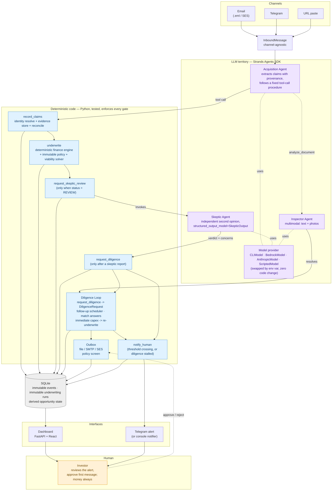

# DealSieve

**A persistent acquisition agent that rejects deals, remembers exactly why, computes what would change its mind, and interrupts you only when that happens.**

Built for the AWS *Agents for Humans* hackathon ([agentsforhumans.devpost.com](https://agentsforhumans.devpost.com/)) with the [Strands Agents SDK](https://strandsagents.com/), track: **Professional Agents**.

## The problem

Acquisition professionals see far more deals than they can underwrite, and almost all of them are correctly ignored — but "ignored" usually means "forgotten," so a legitimate objection (price, leverage, tenant concentration) never gets revisited even after the one fact that caused it changes. Existing AI tools make this worse by optimizing for reading speed: extract the rent roll faster, summarize the OM faster, so a human can look at *more* deals per hour. That is the wrong axis — the scarce resource is attention, not reading time, and no amount of faster summarization tells you which of the 71 deals you rejected last month are now one broker email away from being investable.

## What makes it different

DealSieve is not another AI-reads-the-OM copilot. Document extraction is one small internal step. The product is a standing, evidence-backed opinion that DealSieve holds on every opportunity it has ever seen, for as long as it exists:

- **Persistent opinion** — every opportunity is a row that lives forever. A rejection is not deleted or forgotten; it is stored with the deterministic reasoning that produced it and an immutable event history of everything that happened since.
- **Counterfactual viability frontier** — for every rejected deal, DealSieve doesn't just say "no," it solves for the exact price at which every economic gate would pass, and names which gate is binding. Not "buy" or "pass" — "not now, and here's the number."
- **Interrupt-only-on-change** — rejecting 71 of 84 deals produces zero notifications, not 71 of them. A human is interrupted exactly once, and only when a monitored condition actually flips the verdict.

## 60-second demo walkthrough

Real numbers from the working system: **8330 Power Inn Road, Sacramento** (8-unit small-bay industrial, 20,000 sf), under the frozen policy in [`config/investment_policy.yaml`](config/investment_policy.yaml) ($500k equity, $75k reserve target, 8.0% min normalized cap, 1.35x min DSCR, ≤25% largest tenant, 75% max LTV, 7%/25-yr debt):

1. **Broker email arrives** (`fixtures/emails/01_initial_offer.eml`, OM attached) — asking $1,550,000, broker-stated NOI $126,000 (8.13% cap).
2. **DealSieve extracts, normalizes and underwrites.** After a property-tax reset to 1.25% of price, a 5% vacancy floor, 5% management and a $0.25/sf capex reserve, normalized NOI is **$99,575** at a **6.42%** cap, DSCR **1.02x**. Status: **WATCH**. Viability solver: max viable price **$1,285,946** (17.0% below asking), binding constraint minimum normalized cap rate (DSCR binds within ~$10k of it). No human notified — this is a good, quiet outcome.
3. **Later, the price drops** (`fixtures/emails/02_price_drop.eml`, same thread): "Seller reduced this to $1.25M." DealSieve recognizes the same opportunity via the email thread, records an `ASKING_PRICE_CHANGED` event, and re-underwrites automatically: NOI $103,325, normalized cap **8.27%**, DSCR **1.43x**, LTV 68%. Status flips **WATCH → REVIEW**.
4. **The independent Skeptic Agent runs** (only because the deal now passes every gate) and flags what nothing in the record supports: roof age, Phase I environmental, CAM reconciliation. It drafts an information request to the broker and waits for human approval — nothing is ever sent automatically.
5. **First human alert fires**, on Telegram (or the console notifier locally):

```text
DEAL #113 JUST BECAME INVESTABLE
8330 Power Inn Road, Sacramento, CA

Price            $1,550,000 -> $1,250,000
Normalized cap   6.42% -> 8.27%   PASS
DSCR             1.02x -> 1.43x   PASS
Largest tenant   19%              PASS

Previously failed solely on valuation.

Still unresolved:
- roof age
- Phase I environmental
- CAM reconciliation
- lease rollover concentration

Awaiting your approval: information request to the broker (3 questions)

[Review] [Approve broker questions] [Ignore]
```

6. **Human taps Approve.** The information request is dispatched via the outbox. The thread is now approved for diligence follow-ups.
7. **Broker replies with Property Condition Report** (`fixtures/emails/05_inspection_report.eml`, condition report PDF attached with photos) — "Attached is the property condition report the seller commissioned in June; roof and HVAC are on pages 3-6."
8. **Strands Inspector Agent analyzes document and photos.** It reads the report and inspects embedded photos of ponding and blistering on the 2001 built-up roof membrane. It marks the roof diligence request answered, flags the roof at the end of service life, and extracts **$90,000** of immediate capex.
9. **DealSieve re-underwrites on the all-in basis.** Total basis rises from $1.25M to $1.34M ($1,250,000 + $90,000). Normalized cap rate drops to **7.71%**, DSCR to **1.30x**, LTV to **75.2%**. Status moves **REVIEW → NEAR** (fails valuation after capex; viable below $1,208,108).
10. **A second human alert fires** with a pending price-credit draft ($42,000 credit requested to restore viability):

```text
DEAL #113 FELL BACK BELOW THRESHOLD
8330 Power Inn Road, Sacramento, CA

Diligence established: Roof age: Original built-up membrane installed 2001...
Immediate capex added: $90,000

Price basis      $1,250,000 -> $1,340,000
Normalized cap   8.27% -> 7.71%   FAIL
DSCR             1.43x -> 1.30x   FAIL
LTV              68.00% -> 75.20% FAIL

New status: NEAR
Viable below $1,208,108, 3.4% under the ask

Drafted for your approval: request a $42,000 credit.

[Review] [Approve] [Reject]
```

11. **Autonomous follow-ups & stall detection.** Unanswered diligence requests (Phase I, CAM) are followed up on a policy cadence; if the broker goes dark, the loop stalls and alerts the human.

(Deal numbers are sequential from #101; after the 12 seeded deals the demo property becomes #113.)

For contrast, `fixtures/emails/03_structural_single_tenant.eml` (2 tenants, 78% concentration, $950k asking, 9.7% broker cap) comes back **DEAD** with no viable price at any level — structural failures aren't a pricing problem, so DealSieve doesn't watch them.

## Architecture



Full-resolution rendering: [`architecture/architecture.png`](architecture/architecture.png). Source and a written walkthrough of the three boundaries: [`architecture/architecture.md`](architecture/architecture.md).

## How Strands is used

- **Acquisition Agent** (`dealsieve/agents/acquisition.py`) — a Strands `Agent` with code-gated tools (`dealsieve/agents/tools.py`): `record_claims`, `analyze_document`, `underwrite`, `request_skeptic_review`, `request_diligence`, `request_price_adjustment`, `notify_human`. The model's job is faithful extraction and following a fixed procedure; **every gate that decides what happens next is enforced in the Python tool body, not the prompt** — e.g. `notify_human` returns `{"skipped": "no threshold crossing"}` unless the underwriting run just flipped status, and `request_price_adjustment` calculates the exact mathematical credit needed from the viability frontier. The model cannot bypass a gate; it can only call the tool and read back what the tool decided.
- **Skeptic Agent** (`dealsieve/agents/skeptic.py`) — a second, independent Strands `Agent` with no tools, invoked via `structured_output_model=SkepticOutput` (a Pydantic model: verdict, summary, a list of concerns with severity and evidence status). It never recomputes finance; it only argues that the numbers rest on unverified claims.
- **Inspector Agent** (`dealsieve/agents/inspector.py`) — a third Strands `Agent` with multimodal capabilities, invoked by `analyze_document` on inspection reports and property condition assessments. It analyzes both document text and embedded photo images (ponding, membrane blistering, rooftop HVAC condition), extracts immediate/deferred capex line items, and resolves open diligence requests with evidence provenance.
- **`CLIModel`** (`dealsieve/models/cli_model.py`) — a custom Strands `Model` provider that runs a local coding-agent CLI (`claude -p`, `codex exec`, or `agy -p`) as the LLM, so day-to-day development and the offline demo use existing CLI subscriptions instead of API keys. It renders the whole Strands request (system prompt, tool specs, transcript, images) into one prompt, asks the CLI for a `{tool_calls, final_text}` JSON object against a fixed schema, and replays the answer as the `StreamEvent` sequence the Strands event loop expects.
- **`ScriptedModel`** (`dealsieve/models/scripted.py`) — deterministic turn-by-turn replay from `fixtures/scripted/*.json`, used by the test suite and the offline demo so the exact numbers above reproduce with zero network calls and zero variance.
- **`BedrockModel` / `AnthropicModel`** — Strands' own providers, swapped in purely by environment variable (`DEALSIEVE_MODEL_BACKEND=bedrock|anthropic`) with no code change; see the model backend table below.

## The four boundaries

| Layer | What it does | Where it lives | Who/what can change it |
|---|---|---|---|
| Probabilistic extraction | Reads a messy email/OM, produces `ExtractedClaims` with per-fact provenance | Acquisition Agent (LLM) | The model — but its output is validated data, never trusted arithmetic |
| Deterministic finance | Normalizes economics, computes financing, evaluates gates, solves the viability frontier | `dealsieve/underwriting/**` (pure functions, `Decimal`, no I/O) | Only tested Python code; the model never does arithmetic |
| Immutable policy | Thresholds: min cap, min DSCR, max LTV, tenant concentration, capital available | `config/investment_policy.yaml` | Nobody at runtime — agents may read it, never write it; every run records the `policy_version` it was evaluated under |
| Human irreversible decisions | Approve/reject a broker draft; the only thing that can send an outbound message | Dashboard / Telegram callback | Only a human, explicitly, per draft |

## Trust boundaries in the diligence loop

The loop sends email on your behalf and reads documents a stranger attached, so every step that could be abused is gated in code, not in a prompt:

- **Human approval is a real gate.** `POST /api/drafts/{id}/approve`, `/reject` and `/api/diligence/tick` accept only loopback clients by default; set `DEALSIEVE_APPROVER_TOKEN` and the dashboard (or Telegram bot) must present it in `X-DealSieve-Approver`. The approving principal is recorded on the `HUMAN_APPROVED_DRAFT` event. Approval is a compare-and-set transition with a stable Message-ID per draft, so a double click or a retried request can never send twice.
- **Money never leaves without you.** Every outbound message, whatever the agent called it, passes a deterministic screen for price, credit, deposit, contingency, financing, LOI and purchase-agreement language. Anything that trips it is stored as a pending credit request or offer for your approval, and the attempt is logged as `OUTBOUND_BLOCKED`.
- **Capex is verified, not believed.** Figures the Inspector proposes from a report are accepted only when both ends of the range appear in the document's own text (tolerant of `$85,000`, `85,000`, `85000`, `$85k`, en dashes and odd spaces). Rejected proposals are recorded on the deal and never touch underwriting. Immediate capex is recomputed from the union of verified items across every analysis of the property, deduplicated by item, with disagreements written to the deal's conflicts.
- **Diligence questions come from the skeptic, not the email.** The agent's requested items are reconciled against the skeptic's own questions; unmatched items are dropped, so text in a broker email or PDF cannot steer what gets asked. Credit requests are only drafted after a real threshold loss or a same-message change.
- **Alerts tell the truth.** A notification is persisted as intent, marked delivered only after the notifier returns, and resumed on the next run if delivery failed. `notified_human` in the outcome means delivered.
- **Follow-ups cannot run away.** Due requests are reserved atomically before anything is sent, re-checked for answers, and capped by policy; two schedulers ticking at once send one follow-up.
- **Files stay in their box.** Extracted images are served only from under `DEALSIEVE_DOCS_DIR`, resolved, no symlinks.

## Quick start

```bash
make setup           # python 3.12 venv + deps (uses uv)
cp .env.example .env
make test            # 304 deterministic tests, no model calls (2 live tests excluded by default)
make demo-offline    # the whole story with the scripted model: seed 12 deals, broker email -> WATCH,
                     # price drop -> REVIEW + alert box. Runs in about 3 seconds.
make frontend        # build the dashboard (needs Node 20+)
make api             # http://localhost:8000  (PORT=8010 make api if 8000 is taken)
```

`make demo` runs the same two emails through a real model, chosen by `DEALSIEVE_MODEL_BACKEND` in `.env` (default `cli`, which shells out to the `claude` CLI). Measured on the demo fixtures: Claude Sonnet via `claude -p` takes about 3 minutes per email; Gemini Flash via `agy` (`DEALSIEVE_CLI_PROVIDER=agy DEALSIEVE_CLI_MODEL=gemini-3.8-flash-low`) about 1 to 2 minutes; both land on the same WATCH -> REVIEW result.

The API serves the built dashboard (`frontend/dist`, gitignored) on every non-`/api` route and shows a plain HTML notice with links to `/api/health` when it has not been built. For hot reload during frontend work see [`frontend/README.md`](frontend/README.md); `VITE_MOCK=1 npm run dev` runs the dashboard on fixture data with no backend at all.

## Model backends

Selected by `DEALSIEVE_MODEL_BACKEND` (`dealsieve/models/backend.py`):

| Backend | Value | Requires | Key env vars |
|---|---|---|---|
| Local CLI (default) | `cli` | One of the `claude`, `codex`, or `agy` CLIs installed and authenticated | `DEALSIEVE_CLI_PROVIDER` (`claude`\|`codex`\|`agy`, default `claude`), `DEALSIEVE_CLI_MODEL` (default `sonnet`) |
| Anthropic API | `anthropic` | `ANTHROPIC_API_KEY` | `DEALSIEVE_ANTHROPIC_MODEL` (default `claude-sonnet-5`) |
| AWS Bedrock | `bedrock` | AWS credentials with Bedrock access | `AWS_REGION` (default `us-west-2`), `DEALSIEVE_BEDROCK_MODEL` (default `global.anthropic.claude-sonnet-4-6`) |
| OpenAI | `openai` | `OPENAI_API_KEY` | `DEALSIEVE_OPENAI_MODEL` |
| Scripted (tests + offline demo) | `scripted` | Nothing — replays `fixtures/scripted/*.json` | `DEALSIEVE_SCRIPT` (only needed if the ingestion source filename doesn't match a fixture stem; `dealsieve ingest`/`scripts/inject_email.py` auto-resolve `fixtures/scripted/<stem>.json` from the input filename) |

Other environment variables (`.env.example`): `DEALSIEVE_DB_PATH` (default `data/dealsieve.db`), `DEALSIEVE_POLICY_PATH` (default `config/investment_policy.yaml`), `DEALSIEVE_NOTIFIER` (`console`\|`telegram`).

## CLI reference

`dealsieve` (`dealsieve/cli.py`, installed via `pyproject.toml`'s `[project.scripts]`):

| Command | Does |
|---|---|
| `dealsieve ingest <file.eml\|.txt>` | Pushes one message through the full pipeline (`--db`, `--policy` overrides) |
| `dealsieve seed` | Resets the DB and loads demo data (`scripts/seed_demo.py`): fixtures 03/04 through the real pipeline plus ~10 synthetic Sacramento-area opportunities for dashboard texture |
| `dealsieve reset` | Deletes and recreates the database (`scripts/reset_db.py`) |
| `dealsieve serve [--port] [--host] [--reload]` | Runs the FastAPI dashboard/API server |
| `dealsieve telegram-bot` | Long-polls Telegram (`getUpdates`) for messages, documents, and inline-keyboard callbacks |
| `dealsieve status [deal#]` | Prints dashboard stats, or one deal's detail |
| `dealsieve followup [--as-of YYYY-MM-DD]` | Advances overdue diligence requests, batches follow-ups, and detects stalled loops |
| `dealsieve outbox` | Lists all outbound messages and delivery references from the outbox |

`scripts/inject_email.py <file.eml>` is equivalent to `dealsieve ingest` and prints a readable before/after summary; `scripts/seed_demo.py` and `scripts/reset_db.py` back the `seed`/`reset` subcommands.

## Telegram setup

1. Create a bot with [@BotFather](https://t.me/BotFather), get the token.
2. Message the bot once (or add it to a chat), then fetch your chat id from `https://api.telegram.org/bot<token>/getUpdates`.
3. Set in `.env`:
   ```bash
   DEALSIEVE_NOTIFIER=telegram
   TELEGRAM_BOT_TOKEN=<token>
   TELEGRAM_CHAT_ID=<chat id>
   ```
4. Run `dealsieve telegram-bot` to long-poll for inbound Telegram messages/documents and inline-keyboard approvals. Without a token and chat id, `get_notifier()` falls back to `ConsoleNotifier`, which prints the same alert to stdout — the demo never depends on Telegram being configured.

## AgentCore deployment

**Status: deployable, not deployed** — there are no AWS credentials on this build machine yet. The entrypoint (`dealsieve/agentcore_app.py`, a `BedrockAgentCoreApp` wrapping the same `process_inbound` pipeline used everywhere else) is written and locally verified; the steps below are exact but have not been run against real AWS infrastructure.

Local check (no AWS needed):
```bash
python -m dealsieve.agentcore_app
curl -X POST localhost:8080/invocations -H "Content-Type: application/json" -d '{"type":"status"}'
```
This returns the same `DashboardStats` JSON the `/api/stats` endpoint serves. Other payload shapes: `{"type":"email","eml_base64":"..."}`, `{"type":"text","text":"...","sender":"..."}`, `{"type":"deal","id":"101"}`.

To deploy for real, once AWS credentials are configured:
```bash
uv pip install bedrock-agentcore-starter-toolkit   # provides the `agentcore` CLI
agentcore configure --entrypoint dealsieve/agentcore_app.py
agentcore launch
```
`agentcore configure` builds the container image and IAM role for the entrypoint above; `agentcore launch` deploys it to an AgentCore Runtime endpoint. Set `DEALSIEVE_MODEL_BACKEND=bedrock` (plus `AWS_REGION`) in the runtime's environment so the deployed agent uses `BedrockModel` instead of a local CLI.

## Repository layout

```text
dealsieve/
├── agents/            acquisition.py, skeptic.py, inspector.py, tools.py — Strands agents + deterministic tools
├── api/                FastAPI app (dashboard/API surface)
├── diligence/          deterministic diligence loop: screening, follow-ups, answer matching, stall handling
├── evidence/           reconcile.py — claims -> WorkingValues, conflict-preserving
├── identity/           resolver.py — same-property resolution across messages
├── ingestion/          email.py, text.py, telegram.py — channel adapters with image extraction
├── models/             backend.py, cli_model.py, scripted.py — the swappable model layer
├── notifications/      console.py, telegram.py, format.py — the human interrupt
├── outbound/           delivery backends: FileOutbox, SmtpOutbox, RecordingOutbox
├── persistence/        db.py, repo.py — SQLite, immutable events/runs, derived opportunity
├── policy/             loader.py — reads config/investment_policy.yaml, never writes it
├── schemas/            core.py — every Pydantic contract in the system
├── underwriting/       normalize.py, financing.py, gates.py, viability.py, stress.py, classify.py,
│                       compare.py, engine.py — the deterministic finance engine
├── agentcore_app.py    AWS Bedrock AgentCore entrypoint
├── cli.py              `dealsieve` command-line entry point
└── pipeline.py         process_inbound: the one entry point every channel calls

config/investment_policy.yaml   the frozen investment policy
fixtures/                       emails/, om/, expected/, scripted/, photos/ — the demo & test fixtures
frontend/                       Vite + React + TypeScript + Tailwind dashboard
scripts/                        inject_email.py, seed_demo.py, reset_db.py, build_fixture_pdfs.py
tests/                          underwriting/, identity/, persistence/, agents/, api/, diligence/, e2e/
architecture/                   architecture.mmd, architecture.md, architecture.png
docs/                           DEALSIEVE_PLAN.md, CONTRACTS.md, SUBMISSION.md, DEMO_SCRIPT.md
```

## Testing

```bash
make test
```

**366 tests pass, 2 deselected** (`@pytest.mark.live` tests that run through real CLIs — excluded by default via `pyproject.toml`'s `addopts`, run explicitly with `make test-live`). Coverage spans gate boundaries, amortization against a known payment table, the property-tax reset, the viability bisection solver, stress scenarios, classification, identity resolution (address fuzzing, reply-thread matching), reconciliation and conflict preservation, the `CLIModel` render/parse cycle against an injected fake runner, the scripted-model replay, tool gating (`notify_human` refuses without a real threshold crossing; `request_diligence` requires REVIEW status; `request_price_adjustment` enforces frontier math), the diligence loop and follow-up engine, the FastAPI surface, and the full multi-act path end to end (`tests/e2e/test_watch_to_review.py` and `tests/e2e/test_diligence_loop.py`).

## Roadmap

Reusable primitive: **persistent opportunity state + deterministic investment policy + monitored counterfactual thresholds.** Beyond the hackathon slice:

1. Broker-email monitoring at scale (mailbox-wide, not one fixture at a time).
2. Listing monitoring (crawl/API sources instead of forwarded email).
3. Off-market owner universe (assessor data, not just inbound broker flow).
4. Loan-rate and seller-financing monitoring — the viability frontier already supports a price axis; rate and financing-structure axes are the natural next dimensions.
5. Market-rent and transaction comps to sanity-check normalized NOI against something other than the stated rent roll.
6. Automated owner outreach.
7. Extend the primitive beyond CRE — small businesses, franchises, private credit, equipment acquisitions — anywhere "reject with a remembered, monitored counterfactual" beats "reject and forget."

## License

[MIT](LICENSE).
