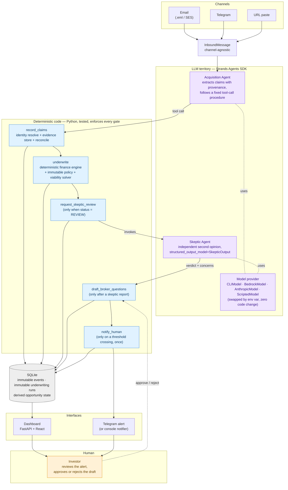

# DealSieve architecture

Rendered image: [`architecture.png`](architecture.png) (generated from `architecture.mmd` via
`npx -y @mermaid-js/mermaid-cli -i architecture/architecture.mmd -o architecture/architecture.png -w 1600 -b white`).

Three boundaries are color-coded in the diagram:

- **LLM territory (purple)** — the Strands Acquisition Agent and the independent Skeptic Agent. This
  is where ambiguity lives: reading a messy email or OM and turning it into structured claims, or
  arguing the other side of a deal that already passed every gate. The model provider underneath
  either agent is swappable by environment variable with no code change.
- **Deterministic code (blue)** — the five tools the Acquisition Agent calls. Every dollar of
  arithmetic, every gate comparison, and every guard on *when* a tool is even allowed to act
  (`notify_human` only fires on a real threshold crossing; `draft_broker_questions` only after a
  skeptic report exists) lives here, in tested Python. The model cannot bypass a gate — it can only
  call the tool and read back what the tool decided.
- **Human (orange)** — the only actor who can approve a draft, reject it, or send anything to a
  broker. Nothing crosses this line automatically.

SQLite sits underneath as the immutable record (events and underwriting runs are append-only; the
`Opportunity` row is the only mutable, derived projection of that history). The dashboard and the
Telegram alert are both read/notify surfaces over that same store — neither one is a second source of
truth.

