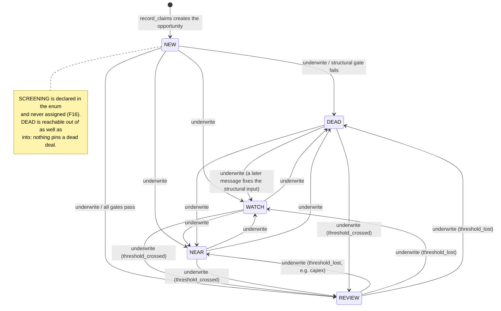
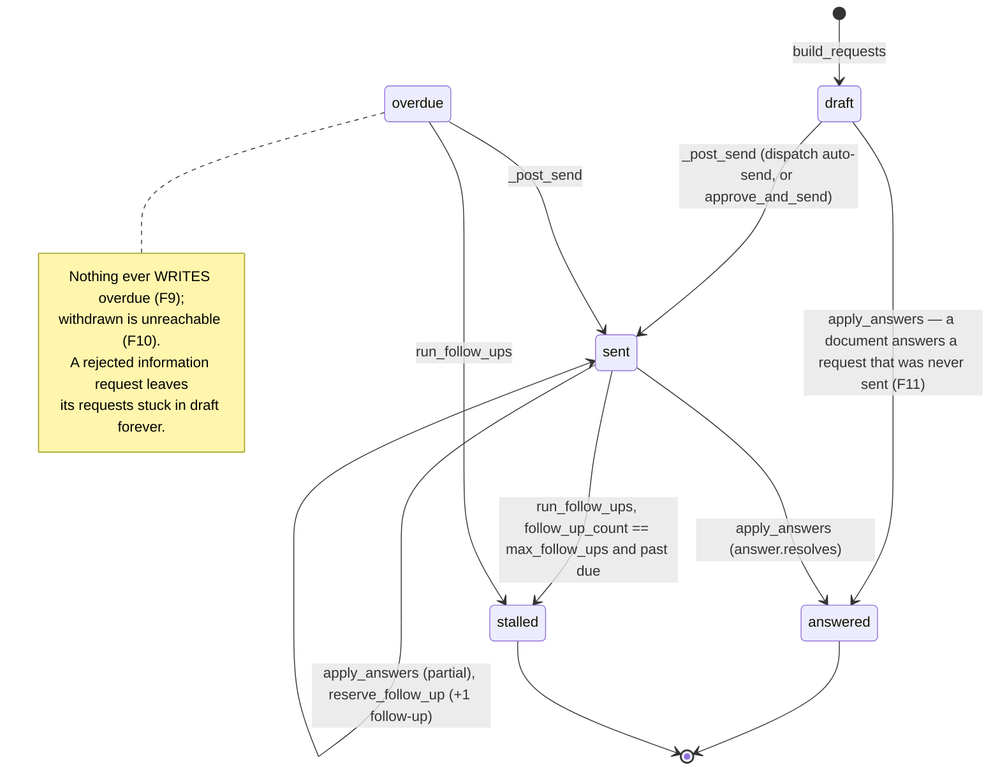
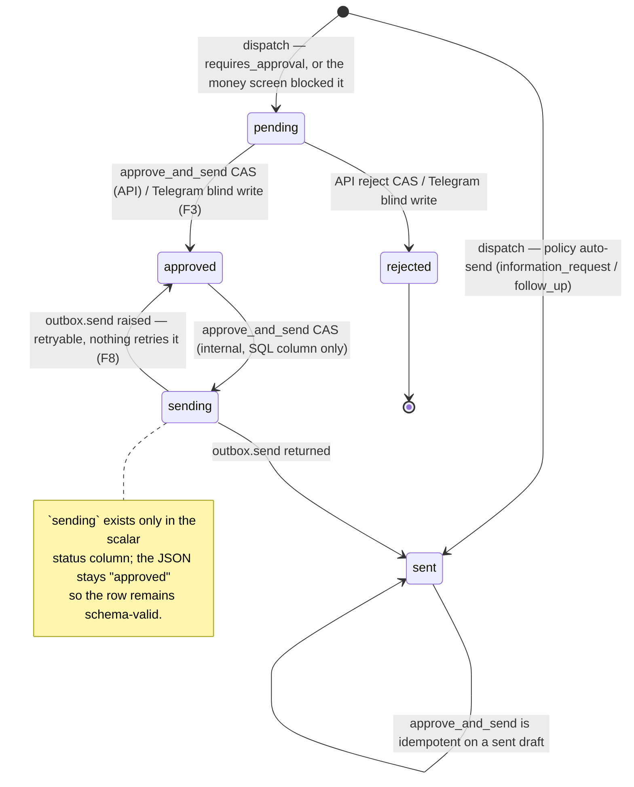
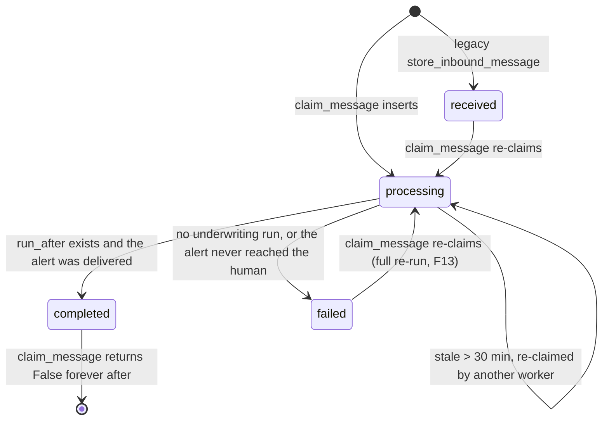

# DealSieve state machine, invariants and findings

A TLA+-style audit written by reading the code, not by running a model checker. It derives the
system's state variables and transitions from the implementation, states the safety and liveness
properties the design intends, and checks each one against the code with a verdict.

Verdicts:

- **HOLDS** — the code makes the property true on every reachable path I could find.
- **VIOLATED** — a reachable execution breaks it (each one has a reproduction or an exact code path).
- **UNENFORCED** — nothing in the code contradicts it today, but nothing enforces it either: it
  survives on convention, on a prompt, or on the current fixtures.

Line references are `file:line` at the commit this was written against. Everything was read; three
findings (F1, F2, F5) were additionally reproduced against a throwaway SQLite database.

Scope note: `dealsieve/underwriting/**` is treated as a pure function `run_underwriting(v, P)`; its
internal arithmetic is W1/W9's territory and is only audited where it feeds a state variable.

---

## 1. State variables

### 1.1 Global / repository state

| Variable | Domain | Written by |
|---|---|---|
| `properties[property_id]` | `Property` | `repo.upsert_property` — `persistence/repo.py:310`; called only from `perform_record_claims` (`agents/tools.py:325`) and `scripts/seed_demo.py` |
| `opportunities[opportunity_id]` | `Opportunity` | `repo.create_opportunity` (`repo.py:352`), `repo.save_opportunity` (`repo.py:402`) — callers: `agents/tools.py` (record_claims, analyze_document, underwrite), `scripts/seed_demo.py` |
| `events[opportunity_id]` | ordered list of `OpportunityEvent` | `repo.append_event` (`repo.py:442`) only. Append-only: no update/delete method exists |
| `runs[run_id]` | `UnderwritingResult` | `repo.store_underwriting_run` (`repo.py:524`) only. Insert-only |
| `evidence[opportunity_id]` | list of `Evidence` | `repo.store_evidence` (`repo.py:488`) — `INSERT OR REPLACE` on `evidence_id` |
| `source_documents` | (opportunity, message, filename, sha256, text) | `repo.store_document` (`repo.py:509`) |
| `document_analyses[analysis_id]` | `DocumentAnalysis` | `repo.store_document_analysis` (`repo.py:824`). Insert-only |
| `diligence_requests[request_id]` | `DiligenceRequest` | `store_diligence_request` (`repo.py:714`), `update_diligence_request` (`repo.py:737`), `reserve_follow_up` (`repo.py:758`) |
| `outbound_drafts[draft_id]` | `OutboundDraft` (+ internal `sending`) | `store_draft` (`repo.py:595`), `update_draft` (`repo.py:613`), `transition_draft` CAS (`repo.py:621`) |
| `notifications[notification_id]` | `Notification` | `store_notification` (`repo.py:660`), `update_notification` (`repo.py:692`) |
| `skeptic_reports[report_id]` | `SkepticReport` | `store_skeptic_report` (`repo.py:570`). Insert-only |
| `inbound_messages[message_id]` | `InboundMessage` + processing status | `store_inbound_message`, `claim_message`, `mark_message_completed/failed`, `link_message_to_opportunity` |
| `policy` | `InvestmentPolicy` (frozen pydantic, `policy/loader.py:98`) | Never written. `record_policy_version` (`repo.py:557`) records a *copy* in `policy_versions` |

### 1.2 `Opportunity` (derived current state) — `schemas/core.py:386`

| Field | Domain | May change it |
|---|---|---|
| `status` | `NEW \| SCREENING \| DEAD \| WATCH \| NEAR \| REVIEW` | `perform_underwrite` (`agents/tools.py:876`) only (+ `seed_demo`) |
| `previous_status` | same ∪ `None` | `perform_underwrite` (`tools.py:874`), only when the status actually changed |
| `current_asking_price` | `Money \| None` | `perform_record_claims` (`tools.py:446`) |
| `working_values` | `WorkingValues \| None` | `perform_record_claims` (`tools.py:445`), `perform_analyze_document` (`tools.py:759-761`, capex only) |
| `latest_run_id` | `run_id \| None` | `perform_underwrite` (`tools.py:877`) |
| `viability` | `ViabilityFrontier \| None` | `perform_underwrite` (`tools.py:878`) |
| `human_attention_required` | bool | `perform_underwrite` (`tools.py:880`): `status == REVIEW`. Never cleared by a human action |
| `broker_email/name`, `broker_property_ref`, `listing_url` | str \| None | `perform_record_claims` (`tools.py:447-454`) |

`SCREENING` is declared in the enum and never assigned anywhere. `NEW` exists only between
`create_opportunity` and the first `underwrite`.

### 1.3 `WorkingValues.immediate_capex` — `schemas/core.py:252`

Domain: `Money >= 0`. Written in exactly two places:

- `perform_analyze_document` (`tools.py:750-763`) — set to
  `immediate_capex_from(aggregate_capex_items(all stored analyses), policy)`.
- `reconcile` (`evidence/reconcile.py:326`) — *carried forward* from the previous `WorkingValues`;
  a new message never resets it.

`capex_items` is the union of verified items across analyses (`tools.py:612`), keyed on
casefolded/whitespace-collapsed item text.

### 1.4 `DiligenceRequest` — `schemas/core.py:524`

`status ∈ {draft, sent, answered, overdue, stalled, withdrawn}`.
Also mutable: `sent_at`, `due_at`, `last_follow_up_at`, `follow_up_count`, `answered_at`,
`answer_summary`, `answer_evidence_ids`, `answered_by_document`.

Writers: `diligence.build_requests` (creates `draft`), `diligence._post_send` (`→ sent`,
`diligence/__init__.py:244`), `diligence.apply_answers` (`→ answered`, `:431`),
`diligence.run_follow_ups` (`→ stalled`, cadence fields, `:498`), `repo.reserve_follow_up`
(`follow_up_count`, `last_follow_up_at`, `follow_up_reserved_at`).

`overdue` and `withdrawn` are **never written by any code path** — see F9, F10.

### 1.5 `OutboundDraft` — `schemas/core.py:499`

`status ∈ {pending, approved, rejected, sent}` in the schema, plus an internal reservation value
`sending` that lives only in the scalar SQL column (`repo.py:621-641`).
`kind ∈ {information_request, follow_up, credit_request, offer, other}`.
`requires_approval: bool`.

Writers: `diligence.dispatch` (`:267`), `diligence.approve_and_send` (`:314`),
`api._decide_draft` (reject, `api/app.py:240`), `TelegramBot._handle_callback`
(`ingestion/telegram.py:140`).

### 1.6 `Notification` — `schemas/core.py:477`

`kind ∈ {threshold_crossed, fell_below_threshold, diligence_stalled, structural_dead,
status_update, draft_pending}`; `delivered: bool`; `delivery_ref: str | None`;
`dedupe_key: str | None` (UNIQUE index, `persistence/db.py` init, nullable ⇒ NULLs never collide).

Only three kinds are ever produced: `threshold_crossed` and `fell_below_threshold`
(`agents/tools.py:1486-1488` via `build_alert`), `diligence_stalled` (`diligence/__init__.py:624`).

### 1.7 Inbound message processing status — `persistence/db.py` DDL, `repo.py:206`

`status ∈ {received, processing, completed, failed}`, plus `error`, `updated_at`.
`received` is only produced by the legacy `store_inbound_message` path; `claim_message` treats it as
claimable.

### 1.8 `ProcessingSession` (per-message, in memory) — `agents/tools.py:141`

The phase machine and the latches:

- `phase: int` — lowest tool rank still allowed; `tools_called: set[str]`.
  `TOOL_RANK = {record_claims:0, analyze_document:1, underwrite:2,
  request_skeptic_review/request_diligence/request_price_adjustment:3, notify_human:4}` (`:119`).
  `REPEATABLE_TOOLS = {analyze_document}` (`:130`).
- `threshold_crossed`, `threshold_lost` — write-once latches set in `perform_underwrite`
  (`:886-889`), never cleared.
- `run_before`, `run_after`, `underwrite_result`, `skeptic_report`, `diligence_requests`,
  `pending_request`, `credit_draft`, `notification`, `undelivered_notification`,
  `notification_error`, `analyses`, `claims_recorded`, `events_created`, `event_types_created`,
  `errors`.

---

## 2. Actions

Each action is `precondition ⇒ effect / events`. "Events" are `OpportunityEvent` rows appended.

### 2.1 External: inject a message

| Action | Precondition | Effect | Events |
|---|---|---|---|
| **inject(new message)** | `claim_message` finds no row (`repo.py:229`) | row inserted `status=processing`; session built; agent runs; safety net runs; `_finish` marks `completed` or `failed` (`pipeline.py:316`) | everything below |
| **inject(duplicate, completed)** | stored row `status == completed` (`repo.py:251`) | `_duplicate_outcome` (`pipeline.py:104`): reads only, returns `summary="duplicate …"` | none |
| **inject(duplicate, processing & fresh)** | row `status == processing`, `updated_at` within 30 min (`repo.py:53,259-266`) | same duplicate outcome — but the message is **not** actually done (F14) | none |
| **inject(retry of failed / stale processing)** | `status ∈ {received, failed}` or stale `processing` | row re-claimed as `processing`, **the whole pipeline re-runs from scratch** | full duplicate set of `MESSAGE_RECEIVED`/`DOCUMENT_ADDED`/`CLAIMS_EXTRACTED`/`UNDERWRITING_COMPLETED` … (F13) |

### 2.2 Tool calls, in the one legal order

| Tool | Guard | Effect | Events appended |
|---|---|---|---|
| `record_claims(claims)` `tools.py:290` | `phase_check` (not already called) | store message; resolve identity (`identity/resolver.py:174`); create Property+Opportunity when unresolved; store evidence; `reconcile`; write `working_values`, `current_asking_price`, broker fields; link message | `MESSAGE_RECEIVED`, `DOCUMENT_ADDED`×n, `DEAL_DISCOVERED` (if created), `NOTE` (ambiguous candidate), `CLAIMS_EXTRACTED`, then one per `DetectedChange` (`ASKING_PRICE_CHANGED`/`NOI_CHANGED`/`RENT_ROLL_UPDATED`); on `MissingInputs`: `NOTE` and early return (`tools.py:424-440`) |
| `analyze_document(filename)` `tools.py:639` | phase; opportunity exists; attachment found (`find_attachment`, `:478`); not already analyzed this message | run inspector agent; **verify** every capex figure against the document text (`verify_capex_items`, `:589`); store analysis; evidence per finding; `match_answers`/`apply_answers`; recompute `immediate_capex` as the union over all analyses (`aggregate_capex_items`, `:612`) | `DOCUMENT_ANALYZED`, `NOTE`×(rejected capex), `DILIGENCE_ANSWERED`×n (from `apply_answers`), `CAPEX_ADJUSTED` (when the total changed) |
| `underwrite()` `tools.py:810` | second call returns the cached result, no new run (`:817`); then phase; opportunity + working values exist | `run_underwriting`; store run; `record_policy_version`; update `status`/`previous_status`/`latest_run_id`/`viability`/`reason_summary`/`human_attention_required`; set latches | `UNDERWRITING_COMPLETED`, `STATUS_CHANGED` (only when status changed) |
| `request_skeptic_review()` `tools.py:936` | opportunity; `run_after`; `status == REVIEW`; not already run; phase | run skeptic agent; store report | `SKEPTIC_REVIEW_COMPLETED` |
| `request_diligence(items)` `tools.py:1110` | phase; opportunity; `run_after`; `status == REVIEW`; a skeptic report **from this message** | model items are reduced to skeptic-derived items (`reconcile_diligence_items`, `:1082`); `build_requests` (status `draft`); `compose_information_request`; `dispatch` | `DILIGENCE_REQUESTED`, plus whatever `dispatch` appends |
| `request_price_adjustment(amount, rationale)` `tools.py:1225` | phase; opportunity; `run_after`; `threshold_lost` **or** (`status ∈ {NEAR, WATCH}` ∧ frontier ∧ this message produced an analysis or an `ASKING_PRICE_CHANGED`) | amount recomputed from the frontier, model's figure overridden beyond ±25% (`:1285`); `compose_credit_request`; `dispatch` (always pending) | `BROKER_DRAFT_CREATED` (via dispatch) |
| `notify_human(note)` `tools.py:1473` | a latch is set; not already notified this message; phase; opportunity + `run_after` | build alert; set `dedupe_key = f"{opp}:{run}:{kind}"`; **persist with `delivered=False` first**; deliver; mark delivered | `HUMAN_NOTIFIED` on success; `NOTE` on delivery failure (`:1396`) |

`dispatch` (`diligence/__init__.py:267`) is the outbound gate:

1. `kind_seen = classify_outbound_text(body + questions)` (`:276`). If it is `credit_request`/`offer`
   → store `pending`, `requires_approval=True`; event `OUTBOUND_BLOCKED` (or `BROKER_DRAFT_CREATED`
   when the draft was already money).
2. Else if `requires_approval` or `kind ∈ policy.outreach.always_require_approval` → store
   `pending`; event `BROKER_DRAFT_CREATED`.
3. Else `outbox.send` → `sent`, `sent_at`, `delivery_ref`; `_post_send`: events
   `DILIGENCE_REQUEST_SENT` / `DILIGENCE_FOLLOW_UP_SENT`, then `BROKER_MESSAGE_SENT`; carried
   requests `→ sent`, `due_at = sent_at + follow_up_after_days`.

### 2.3 Safety-net steps (actor = `SYSTEM`) — `pipeline.py:147`

Each is wrapped independently by `_isolated` (`:124`), which turns a failure into a `NOTE` event plus
an entry in `ProcessingOutcome.summary`.

| Step | Guard | Action |
|---|---|---|
| 1 underwrite | `claims_recorded ∧ run_after is None` | `perform_underwrite(actor=SYSTEM)` |
| 2 skeptic | `threshold_crossed ∧ skeptic_report is None` | `perform_skeptic_review(actor=SYSTEM)` |
| 3 diligence | `threshold_crossed ∧ not diligence_requests` and `diligence_items_from(report)` non-empty | `perform_request_diligence(actor=SYSTEM)` |
| 4 credit | `credit_draft is None ∧ run_after ∧ threshold_lost ∧ frontier is not None` | `perform_request_price_adjustment(None, …, actor=SYSTEM)` |
| 5 notify | `(threshold_crossed ∨ threshold_lost) ∧ notification is None ∧ notification_error is None` | `perform_notify_human(actor=SYSTEM)` |
| 6 resume | `opportunity_id ∧ notification_error is None` | `resume_undelivered_notifications` — delivers **every** stored `delivered=False` row of the opportunity (`tools.py:1444`) |

### 2.4 Human decisions

| Action | Precondition | Effect | Events |
|---|---|---|---|
| **API approve** `POST /api/drafts/{id}/approve` (`api/app.py:262`) | `require_human` (`:140`): matching `X-DealSieve-Approver` token, else loopback client only. Draft exists; status ∈ {pending, approved} (sent ⇒ idempotent no-op) | `diligence.approve_and_send`: CAS `pending→approved`, re-screen the text, CAS `approved→sending`, `outbox.send`, `→ sent`; `_post_send` marks carried requests `sent` with a `due_at` | `HUMAN_APPROVED_DRAFT` (actor `HUMAN`, payload carries `principal`), then `DILIGENCE_REQUEST_SENT`/`BROKER_MESSAGE_SENT`. On send failure: CAS back to `approved` + `NOTE` |
| **API reject** `POST /api/drafts/{id}/reject` (`api/app.py:287`) | `require_human`; CAS `pending→rejected` | draft `rejected`, `decided_at` set. **The carried `DiligenceRequest`s are not touched** | `HUMAN_REJECTED_DRAFT` |
| **Telegram callback approve/reject** (`ingestion/telegram.py:124-152`) | none beyond "the update arrived on this bot". `callback_data = "<action>:<opportunity_id>"`, so it picks `pending[0]` for the opportunity | blind `update_draft` to `approved`/`rejected` (no CAS, no send) | `HUMAN_APPROVED_DRAFT` / `HUMAN_REJECTED_DRAFT` (actor `HUMAN`, no principal) |
| **Telegram review/ignore** | — | `NOTE` event | `NOTE` |

### 2.5 Follow-up tick with `as_of` — `diligence.run_follow_ups` (`diligence/__init__.py:498`)

Entered from `POST /api/diligence/tick` (`api/app.py:311`, `require_human`) or
`dealsieve followup --as-of` (`cli.py:142`).

```
due   := { r | r.status ∈ {sent, overdue} ∧ r.due_at ≠ null ∧ r.due_at ≤ as_of }
group by opportunity:
  eligible := { r ∈ due | r.follow_up_count < P.outreach.max_follow_ups }
  for r ∈ eligible: reserve_follow_up(r, expected=r.follow_up_count, as_of)   # SQL CAS, repo.py:758
      -> follow_up_count += 1, last_follow_up_at = as_of, follow_up_reserved_at = as_of
  if any reserved:
      number  := max(follow_up_count over the claimed set)                     # :538
      draft   := compose_follow_up(...)  # deterministic draft_id drf_fu_<sha(opp:min(request_id):number)>
      sent    := dispatch(draft)
      if sent.status == "sent": each claimed r.due_at := as_of + follow_up_after_days
      else (held pending, or dispatch raised): every reservation rolled back to its snapshot
  stalled := { r ∈ due | r.follow_up_count ≥ max_follow_ups ∧ current status ∈ {sent, overdue} }
      -> status = stalled, due_at = null; event DILIGENCE_STALLED per request
  if stalled ≠ ∅:
      one Notification kind=diligence_stalled,
          dedupe_key = f"{opp}:diligence_stalled:{','.join(sorted request ids)}"
      store_notification (DuplicateNotification -> skip), then notifier.send, then mark delivered
```

Idempotence on a repeated `as_of` comes from: `reserve_follow_up`'s CAS on `follow_up_count`, the
`due_at` push-out after a successful send, and the `dedupe_key` UNIQUE index.

### 2.6 Failure actions

| Action | Where | Effect |
|---|---|---|
| **notifier raises** | `deliver_notification` (`tools.py:1384`) | row stays `delivered=False`; `session.notification_error` set; `NOTE` event; exception re-raised; `process_inbound` marks the message **failed** (`pipeline.py:313`) so a re-run resumes the delivery |
| **outbox raises during `dispatch`** | `diligence/__init__.py:301` | exception propagates. In `run_follow_ups` it is caught, reservations are rolled back, `NOTE` appended (`:552-575`). In `perform_request_diligence` / `perform_request_price_adjustment` the tool `_guard` records it in `session.errors` |
| **outbox raises during `approve_and_send`** | `:370-385` | CAS `sending→approved`, `update_draft`, `NOTE` event, re-raise → API returns 500 |
| **crash between steps** | — | `inbound_messages.status` stays `processing`; after 30 minutes (`repo.py:53`) it is re-claimable and the whole message re-runs. Every already-written event/run/draft/request stays (F13) |

---

## 3. Transition diagrams

### 3.1 `Opportunity.status`



### 3.2 `DiligenceRequest.status`



### 3.3 `OutboundDraft.status`



### 3.4 Inbound message processing status



### 3.5 `Notification`: intent → delivered

```mermaid
stateDiagram-v2
    [*] --> intent: store_notification(delivered=False, dedupe_key) — R3, before any send
    intent --> delivered: notifier.send returned; update_notification(delivered=True, delivery_ref)
    intent --> intent: notifier.send raised; row untouched; NOTE event; message marked failed
    intent --> delivered: resume_undelivered_notifications on a later message of this opportunity
    delivered --> [*]
    state duplicate_key <<choice>>
    [*] --> duplicate_key: store_notification raises DuplicateNotification
    duplicate_key --> [*]: existing row delivered — skip, do not alert twice
    duplicate_key --> intent: existing row undelivered — resume that delivery
    note right of intent
      Gap: notifier.send SUCCEEDS but
      update_notification then fails ->
      the row stays "intent" while the human
      already saw it -> resume sends again (F6).
    end note
```

---

## 4. Safety invariants

### S1 — Event log and run log are append-only and aligned

> For every opportunity, the `seq` values of its events are exactly `1..n` with no gaps and no
> duplicates; no event row and no underwriting-run row is ever updated; and
> `|runs(opp)| == |{e ∈ events(opp) : e.type = UNDERWRITING_COMPLETED}|`.

**Verdict: HOLDS (with one crash-window caveat).**

- `seq` allocation is `max(seq)+1` inside `BEGIN IMMEDIATE` with bounded retry
  (`persistence/repo.py:441-475`, `_run_immediate` at `:129`), and the table carries
  `UNIQUE(opportunity_id, seq)` (`persistence/db.py` DDL). Two `Repo` instances on one file cannot
  collide; `tests/persistence/test_concurrency.py` covers it.
- No `update`/`delete` method exists for `opportunity_events` or `underwriting_runs`.
  `store_underwriting_run` (`repo.py:524`) is a bare `INSERT`, so re-storing a run raises rather than
  overwriting.
- The pairing is maintained by `perform_underwrite`: store the run (`tools.py:844`) then append
  `UNDERWRITING_COMPLETED` (`tools.py:850`). `scripts/seed_demo.py:282,287` does the same. The two
  writes are **not** in one transaction, so a crash between them leaves a run with no event — a
  narrow window, and it fails in the safe direction (a run nobody references). Recorded as F17.

### S2 — Derived status agrees with the run history

> `opp.status == runs(opp).last.status`; every `STATUS_CHANGED` payload `(from, to)` matches a
> consecutive pair of runs; `opp.previous_status` is the status immediately before the latest change.

**Verdict: HOLDS for `k ≥ 2`; the head of the chain is synthetic.**

- `perform_underwrite` (`tools.py:866-881`) sets `status`, `latest_run_id`, `viability`,
  `reason_summary` from the same run object it just stored, and sets `previous_status` only inside
  the `run.status != previous` branch (`:874`) — exactly "the status before the latest change".
- The **first** `STATUS_CHANGED` for an opportunity has `from = NEW` (`schemas/core.py:393`
  default), which is not any run's status. Same in `seed_demo.py:311`. So "matches consecutive runs"
  is true for every pair *after* the first run only. Not a defect, but the invariant must be stated
  with that carve-out.
- Two consecutive runs with the same status emit no `STATUS_CHANGED` — consistent with reading the
  event log as a list of *changes*.
- Nothing else writes `status`: the API, the Telegram bot, `run_follow_ups` and `dispatch` never
  touch it.

### S3 — Notifications correspond to real decision changes and are never doubled

> A delivered `threshold_crossed` notification exists only for a run that entered `REVIEW` from a
> non-`REVIEW` status; `fell_below_threshold` only for a run that left `REVIEW`; at most one
> delivered notification per `dedupe_key`; no notification for `WATCH↔NEAR` or for `DEAD`.

**Verdict: VIOLATED (the "at most one delivered" clause) — see F6. The rest HOLDS.**

- Kind selection is driven purely by the write-once latches: `perform_notify_human` returns
  `{"skipped": "no threshold crossing"}` unless `threshold_crossed` or `threshold_lost`
  (`tools.py:1485-1490`), and the latches are set only on a real `REVIEW` boundary
  (`tools.py:886-889`). `WATCH→NEAR`, `NEAR→WATCH` and any transition into `DEAD` set neither latch,
  so no alert is produced. Safety-net step 5 uses the same guard (`pipeline.py:200-204`). **HOLDS.**
- Uniqueness per key is enforced in SQL: `CREATE UNIQUE INDEX … notifications(dedupe_key)`
  (`persistence/db.py` `init_schema`) plus `DuplicateNotification` (`repo.py:681-688`), and
  `perform_notify_human` treats a duplicate-and-delivered key as "already handled"
  (`tools.py:1509-1515`).
- **The violation**: `deliver_notification` calls `notifier.send` (`tools.py:1384`) and then
  `session.repo.update_notification(notification)` (`:1414`) **outside any try/except**. If the send
  succeeds and the persist fails, `session.notification` is never assigned, the row stays
  `delivered=False`, and safety-net step 6 (`resume_undelivered_notifications`, `pipeline.py:222`)
  finds it in the very same run and sends it again. The human is interrupted twice for one crossing.

### S4 — Nothing that talks money leaves without a human, and nothing is delivered twice

> Any `OutboundDraft` with `status = sent` and `kind ∈ {credit_request, offer}` has a
> `HUMAN_APPROVED_DRAFT` event with `actor = HUMAN` whose `occurred_at ≤ sent_at`; an
> `information_request` is sent without such an event only when
> `policy.outreach.auto_send_information_requests`; a `follow_up` is sent only for requests whose
> information request was sent; `classify_outbound_text(body)` is consistent with `kind` for every
> sent draft; each sent draft has exactly one delivery.

**Verdict: mostly HOLDS; the "exactly one delivery" clause is VIOLATED (F3, F5) and the screen's
coverage is UNENFORCED for the subject line (F4).**

- Money can never be auto-sent. `dispatch` re-classifies the composed text and forces
  `requires_approval=True, status=pending` for `credit_request`/`offer`
  (`diligence/__init__.py:276-291`), and `policy.outreach.always_require_approval` lists both
  (`config/investment_policy.yaml`). `compose_credit_request` hard-codes `requires_approval=True`
  (`:212`). **HOLDS.**
- The only path to `sent` for a money kind is `approve_and_send`, which appends
  `HUMAN_APPROVED_DRAFT` with `Actor.HUMAN` and the principal *before* the send CAS
  (`:354-361`), and re-screens the text after approval (`:334-336`). Ordering
  `occurred_at ≤ sent_at` is guaranteed because `sent_at = now_utc()` is taken after `outbox.send`
  returns (`:386`). **HOLDS.**
- `information_request` auto-send is exactly `requires_approval = not
  policy.outreach.auto_send_information_requests` (`:155`) → `dispatch` step 3. **HOLDS.**
- `follow_up` only ever carries requests in status `sent` (`run_follow_ups` due filter `:510-513`,
  and `reserve_follow_up`'s `AND status = 'sent'` at `repo.py:772`), and a request only reaches
  `sent` through `_post_send` of a draft that was actually delivered. **HOLDS.**
- Text/kind consistency **as literally stated (body + questions) HOLDS** — `dispatch` computes
  `kind_seen` over exactly that string. But the **subject is never screened**, and the demo's own
  subject is `Re: Off-market: 8-unit small-bay industrial, Sacramento — $1.55M / 8.13% cap`, which
  `classify_outbound_text` returns `credit_request` for (verified by running it). See F4.
- **Exactly one delivery is violated** two ways: the Telegram blind write (F3) can revert a `sent`
  draft to `approved`, after which a second approve re-sends; and the deterministic follow-up
  `draft_id` (`:179`) collides with an already-stored row after a rolled-back tick, so
  `dispatch` sends first (`:301`) and only then hits the `store_draft` PK conflict (`:305`) (F5).

### S5 — DiligenceRequest lifecycle

> Only the legal transitions occur (`draft→sent→answered`, `sent→stalled`; `overdue` is derived);
> `follow_up_count ≤ policy.outreach.max_follow_ups`; a request is `stalled` iff its count equals the
> maximum and it was past due when ticked; an answered request is never followed up; `due_at` is set
> iff `status = sent`; the same request is never carried by two follow-ups with the same
> `follow_up_number`.

**Verdict: partially VIOLATED.**

- `follow_up_count ≤ max`: the eligibility filter is `count < max_follow_ups`
  (`diligence/__init__.py:523-527`) and `reserve_follow_up` is a single conditional `UPDATE … WHERE
  follow_up_count = ?` (`repo.py:763-789`), so two concurrent ticks cannot both increment.
  **HOLDS** (`tests/diligence/test_diligence.py:646`).
- An answered request is never followed up: the due filter and the reservation both require
  `status = 'sent'`. **HOLDS.**
- Stall condition: the stall loop reads `follow_up_count` from the pre-reservation snapshot
  (`:601-607`) and re-checks the live status, so a request that reached the maximum *in this tick*
  is not also stalled in it. **HOLDS.**
- `due_at` set iff `sent`: `_post_send` sets it (`:257-264`); `apply_answers` clears it on resolve
  (`:450`); the stall path clears it (`:608`). **HOLDS.**
- `overdue` is derived: **UNENFORCED** — nothing computes or writes it; the dashboard has a colour
  for it (`frontend/src/components/DealPanels.tsx:42`) that can never appear (F9).
- `draft→answered` is reachable and not in the legal set: `analyze_document` passes
  `OPEN_REQUEST_STATUSES = ("draft","sent","overdue")` (`tools.py:475,672-676`) to `match_answers`,
  so a document arriving before the human approves the request marks it `answered` without it ever
  having been asked. **VIOLATED** (F11).
- Unique `(request, follow_up_number)`: the number is `max(follow_up_count)` over the *batch*
  (`:538`), not per request, so a request batched with an older one is labelled with the older one's
  number and can carry that same number again in its own later message. **VIOLATED** (low
  severity, F12) — and the same `max()` is what makes the deterministic `draft_id` collide (F5).

### S6 — Capex enters the basis only through verified, aggregated evidence

> `working_values.immediate_capex == immediate_capex_from(⋃ verified capex items over all analyses of
> the opportunity, policy)`; every stored capex item's `low` and `high` appear in its source
> document's text; the latest run's `all_in_basis == price + immediate_capex`.

**Verdict: HOLDS.**

- Verification: `verify_capex_items` (`tools.py:589-604`) compares each item's `low` and `high` as
  `Decimal` values against every money-shaped figure in `attachment.text`
  (`document_amounts`, `:552`, normalising thin spaces and en dashes). Rejected items are removed
  from the analysis **before it is stored** (`:694`) and each rejection becomes a `NOTE` event
  (`:727-735`). `tests/agents/test_hardening.py:223` covers the injected-item case.
- Aggregation: the total is recomputed from `repo.list_document_analyses(opp)`
  (`:746-750`), i.e. the union over every analysis, not just the newest
  (`aggregate_capex_items`, `:612`), with contradictory prices recorded as conflicts rather than
  silently resolved (`:629-635`).
- Carry-forward: `reconcile` copies `immediate_capex` and `capex_items` from the previous
  `WorkingValues` (`evidence/reconcile.py:326-327`), so an ordinary message never zeroes them.
- `all_in_basis`: `_compute_financing` sets `all_in_basis = _money(price + immediate_capex)`
  (`underwriting/financing.py:74,106`) and the cap-rate denominator is the same quantity
  (`engine.py:112`). **HOLDS by construction.**
- Two soft spots that do not break the invariant but are worth listing: an attachment with no
  extractable text rejects every item (fail-closed, correct but silent), and `_capex_key` matches on
  exact normalised item text, so "Roof replacement" and "Roof membrane replacement" from two reports
  both count (F15).

### S7 — Latest-run internal consistency

> `WATCH`/`NEAR` ⇒ `max_viable_price < asking_price` and (`NEAR` iff `distance_pct ≤
> near_threshold_pct`); `REVIEW` ⇒ every gate passes; `DEAD` ⇒ `structural_failures` non-empty and
> `max_viable_price is None`.

**Verdict: HOLDS except for one reachable `WATCH` shape.**

- `classify` (`underwriting/classify.py:17-28`) is literally: any structural failure → `DEAD`; all
  gates pass → `REVIEW`; `distance_pct ≤ near_threshold_pct` → `NEAR`; else `WATCH`. So
  "`REVIEW` ⇒ all gates pass" and "`NEAR` iff distance within threshold" are definitional. **HOLDS.**
- `DEAD`: `solve_max_viable_price` returns `max_viable_price=None` with the structural failure list
  whenever a structural gate fails at the current price (`viability.py:63-76`), and `classify` uses
  the same gate list. **HOLDS.**
- `WATCH`/`NEAR` ⇒ `max_viable < asking`: for the ordinary case yes — if `max_viable ≥ current` then
  every economic gate passes at `current` (monotonicity) and the deal would be `REVIEW`. But
  `solve_max_viable_price` also returns `max_viable_price=None, distance_pct=None` when *no* price in
  `(0.01, absolute_max]` passes (`viability.py:78-84`, e.g. NOI ≤ 0). `classify` then falls through
  to `WATCH`, giving a `WATCH` deal with no frontier at all. **VIOLATED for that case** (F18) — a
  fail-closed outcome, but it breaks the invariant as stated and it silently disables
  `request_price_adjustment` (`tools.py:1266`).

### S8 — Exactly-once message completion

> Each `message_id` reaches `completed` at most once; a duplicate completed message adds no events,
> runs, drafts or notifications; a failed message may be re-claimed and then completes exactly once.

**Verdict: HOLDS as stated; the retry is not idempotent (F13).**

- `claim_message` returns `False` for `status = completed` and does not touch the row
  (`repo.py:250-252`); `process_inbound` returns `_duplicate_outcome` (`pipeline.py:248`), which only
  reads (`:104-118`). Once completed, no path re-claims it. **HOLDS**
  (`tests/e2e/test_watch_to_review.py::test_duplicate_message_is_ignored`).
- A `failed` row is re-claimable (`repo.py:257`) and the next successful run marks it `completed`.
  **HOLDS.**
- **But** the retry re-runs the entire pipeline: `record_claims` appends `MESSAGE_RECEIVED`,
  `DOCUMENT_ADDED`, `CLAIMS_EXTRACTED` again, `store_document` inserts a second `source_documents`
  row, new `Evidence` ids are minted, and `underwrite` produces a **second immutable run** for the
  same message. Nothing in the invariant forbids it, and the G3 design deliberately marks a message
  failed when an alert did not land — so this duplication is on the *expected* path, not an exotic
  one (F13).
- A non-stale `processing` row also returns the duplicate outcome with the summary "already
  processed", which is a lie for a message another worker is mid-way through (F14).

### S9 — Policy immutability

> Every run's `policy_version` equals the policy the pipeline was given, and the policy is never
> written by code.

**Verdict: HOLDS.**

- `run_underwriting` stamps `policy_version=policy.policy_version` (`engine.py:120`), and
  `policy_version` is a content hash of the YAML text computed at load
  (`policy/loader.py:126-137`). `InvestmentPolicy` is a frozen pydantic model
  (`loader.py:22-23`), so a tool cannot mutate the object it was handed.
- No code writes `config/investment_policy.yaml` (grep: only `load_policy`, `tests/conftest.py` and
  a comment in `seed_demo.py` reference the path). `record_policy_version` (`repo.py:557`) writes to
  the `policy_versions` *table* with `INSERT OR IGNORE`.
- Small caveat, not a violation: `_policy_yaml` re-reads the file at underwrite time
  (`tools.py:280-284,845`). If the file were edited between `load_policy` and the run, the archived
  `raw_yaml` would not hash to the recorded `policy_version` (F19).

### S10 — Provenance and price changes

> Every reconciled field's provenance id refers to a stored `Evidence` row; `asking_price` changes
> only together with an `ASKING_PRICE_CHANGED` event.

**Verdict: HOLDS, with the first-ever price set carrying no event.**

- `perform_record_claims` stores `claims.evidence` (`tools.py:404-405`) **before** calling
  `reconcile` (`:423`), and `provenance[field] = winner.evidence_id` is only ever taken from those
  same items (`evidence/reconcile.py:142-144`). Prior provenance is carried forward from the previous
  `WorkingValues`, whose evidence was stored on the earlier message. **HOLDS.**
- Price: `reconcile` emits `DetectedChange(ASKING_PRICE_CHANGED)` exactly when
  `new_price != existing.asking_price` (`reconcile.py:334-343`), the caller appends every detected
  change (`tools.py:442-443`) and only then writes `opp.current_asking_price` (`:446`). A price
  restated in a reply subject is suppressed and recorded as a conflict instead
  (`reconcile.py:184-215`). The initial establishment (`existing is None`) has no
  `ASKING_PRICE_CHANGED`; it is covered by `DEAL_DISCOVERED` + `CLAIMS_EXTRACTED`. State the
  invariant as "every *change* after the first".

### S11 — Tool phase machine

> Within one message: `record_claims` at most once, `underwrite` at most once, latches never cleared,
> out-of-order calls mutate nothing.

**Verdict: VIOLATED — `request_diligence` and `request_price_adjustment` are unbounded.**

- `record_claims`: `phase_check` rejects a repeat because `record_claims ∈ tools_called`
  (`tools.py:196-197`, advanced at `:433,459`). **HOLDS.**
- `underwrite`: the cached-result short-circuit at `tools.py:817-822` returns the first result with
  `"repeated": true` and creates no new run; `phase_advance` at `:929`. **HOLDS.**
- Latches: only ever assigned `True` (`:886-889`); nothing assigns `False`. **HOLDS.**
- Out-of-order mutates nothing: every `perform_*` calls `phase_check` before its first write
  (`:299, :655, :824, :949, :1119, :1238, :1494`). **HOLDS.**
- **`perform_request_diligence` (`:1110`) and `perform_request_price_adjustment` (`:1225`) call
  `phase_check` but never call `phase_advance`** (grep confirms `phase_advance` appears only at
  `:433, :459, :788, :929, :956, :1517`). Since `phase_check`'s "already ran" test reads
  `tools_called`, which only `phase_advance` populates, both tools are repeatable without limit.
  Reproduced: three `request_diligence` calls produced three `DiligenceRequest` rows with the
  identical topic "Roof age" and three separate pending information-request drafts; two
  `request_price_adjustment` calls produced two pending credit drafts (F1). `build_requests`
  deduplicates only *within one batch* (`diligence/__init__.py:100-119`), never against stored rows,
  so nothing downstream catches it either.

### S12 — Approval gate on every entry point

> No route or callback can move a draft to `sent` without a human principal; the Telegram callback
> path enforces the same gate as the API.

**Verdict: VIOLATED for the Telegram path (F3), and UNENFORCED for the ingest routes (F7).**

- API: `/api/drafts/{id}/approve` depends on `require_human` (`api/app.py:265,140-152`) — a constant-
  time token compare when `DEALSIEVE_APPROVER_TOKEN` is set, otherwise loopback-only — and delegates
  to `approve_and_send`, which does the CAS, the event with `principal`, and the single send.
  `/api/drafts/{id}/reject` and `/api/diligence/tick` carry the same dependency. **HOLDS.**
- Telegram: `_handle_callback` (`ingestion/telegram.py:124-152`) has **no** principal check at all
  (it does not compare the callback's `chat.id` against the configured `TELEGRAM_CHAT_ID`), does a
  **blind `update_draft`** with no compare-and-swap (`:140`), and resolves the target as
  `pending[0]` for the opportunity because `callback_data` only carries `"<action>:<opportunity_id>"`
  (`:129,133`). It also never sends. So it is materially *not* the same gate. **VIOLATED** (F3).
- `POST /api/ingest/email` and `POST /api/ingest/text` (`api/app.py:383,406`) have **no**
  authentication. Under `auto_send_information_requests: true` (a supported, shipped policy —
  `fixtures/policies/autosend_policy.yaml`), an unauthenticated POST can therefore cause outbound
  broker mail. The gate that stops it today is the default policy value, not the route. **UNENFORCED**
  (F7).

---

## 5. Liveness properties

### L1 — Every REVIEW entry eventually produces exactly one delivered `threshold_crossed` alert

**Verdict: HOLDS only under an external retrigger; "exactly one" is broken by F6.**

Mechanism: the agent is *asked* to call `notify_human`, but the guarantee comes from the safety net
(`pipeline.py:200-217`) which fires whenever `threshold_crossed ∧ notification is None`, and from
step 6 (`resume_undelivered_notifications`, `tools.py:1444`) which finishes an intent recorded on an
earlier run. Isolation (`_isolated`, `:124`) means a failing skeptic or a failing diligence step
cannot cost the alert.

Gaps:

- **Nothing schedules the retry.** A notifier that is down marks the message `failed`
  (`pipeline.py:313`), and that is all: there is no sweeper over `inbound_messages WHERE status =
  'failed'` and no sweeper over `notifications WHERE delivered = 0`. Resumption only happens if a
  human re-injects the message or another message arrives on the same opportunity (F20).
- **"Exactly one" fails** when `notifier.send` succeeds and `update_notification` then raises (F6).

### L2 — Every skeptic report with chaseable concerns yields a pending or sent information request

**Verdict: HOLDS on the crossing path; UNENFORCED otherwise.**

Mechanism: safety-net step 3 (`pipeline.py:170-179`) recomputes the item set itself with
`diligence_items_from(session.skeptic_report)` (`tools.py:1011`) and calls
`perform_request_diligence` as `SYSTEM` whenever the model skipped it. The model's own items are only
a *selector* over that set (`reconcile_diligence_items`, `:1082-1107`), and an empty selection falls
back to the whole derived set (`:1105-1106`).

Gap: step 3 is guarded on `threshold_crossed`. `perform_skeptic_review` itself only requires
`status == REVIEW` (`tools.py:945`), so a skeptic report produced on a deal that was *already* in
REVIEW (a second message that does not change the status) yields chaseable concerns that nothing
raises (F21).

### L3 — An approved information request is eventually sent; exhausted follow-ups yield exactly one `diligence_stalled` notification

**Verdict: VIOLATED.**

- "Approved ⇒ eventually sent" is true only through `approve_and_send`, which sends inside the same
  call. The **Telegram approve button does not send** (`ingestion/telegram.py:132-152`) — it sets the
  draft to `approved` and stops. Since the threshold alert's `approve` action is exactly that button
  (`notifications/format.py:37-41`, `notifications/telegram.py` inline keyboard), the advertised
  one-tap approval leaves the request in `draft` forever, the follow-up loop never sees it, and no
  notification tells anyone (F3).
- "Exactly one stalled notification": `run_follow_ups` stores the notification before delivering and
  keys it on the sorted request ids (`diligence/__init__.py:624-640`). If `notifier.send` raises at
  `:637`, the exception escapes `run_follow_ups` entirely (no try/except), the requests are already
  `stalled` and therefore drop out of the `due` set on the next tick, and the second tick's
  `store_notification` hits `DuplicateNotification` and `continue`s (`:635-636`). The alert is then
  **never** delivered and never retried (F22).
- Cadence liveness itself is broken whenever `auto_follow_up_approved_threads: false`: the composed
  follow-up is held pending, the reservation is rolled back, and every subsequent tick recomposes the
  **same deterministic `draft_id`** and dies on the `store_draft` primary-key conflict. Reproduced:
  ticks 2 and 3 each produced only "Diligence follow-up delivery failed; reservations rolled back",
  `follow_up_count` stayed 0 forever, and the requests never stalled (F5).

### L4 — `process_inbound` always returns and marks the message completed or failed

**Verdict: VIOLATED (narrow).**

Mechanism: the agent call is wrapped (`pipeline.py:263-280`), every safety-net action is wrapped
(`_isolated`, `:124`), `_finish` is wrapped (`:89-101`), and the docstring promises "never raises".

Gap: three calls sit **outside** the try block —
`backend_name()` (`:246`), `_claim(repo, message)` (`:248`), and the `ProcessingSession` construction
including `_resolve_outbox(outbox)` (`:251-259`). `get_outbox` raises `OutboxError` for an
unrecognised `DEALSIEVE_OUTBOX` value (`outbound/__init__.py:131`), `FileOutbox.__init__` calls
`load_policy()` which can raise on a bad `DEALSIEVE_POLICY_PATH`, and `claim_message` can raise
`sqlite3.OperationalError` after exhausting its lock retries (`repo.py:167-168`). In all three cases
`process_inbound` raises and the message is left `processing` (or unrecorded) with no `failed` mark
(F23). `_duplicate_outcome` (`:105-109`) is also outside any guard.

### L5 — A pending credit request never blocks or is auto-sent by any tick

**Verdict: HOLDS.**

`run_follow_ups` reads drafts exactly once, to pick an `in_reply_to` from the most recent *sent*
draft (`diligence/__init__.py:539-542`); it never approves, sends, or inspects a pending one. Its
work set is `diligence_requests`, and a credit request carries no `request_ids`
(`compose_credit_request`, `:206-214`). Even if a credit draft were somehow routed through
`dispatch`, the screen (`:278`) and `always_require_approval` (`:293`) both force `pending`. A
pending credit draft therefore neither advances nor obstructs the cadence.

---

## 6. Loose ends

Numbered; each has file:line, a severity, and a proposed fix. **None of these are implemented.**

**F1 — `request_diligence` and `request_price_adjustment` are unbounded within one message
(breaks R5/S11).**
`dealsieve/agents/tools.py:1110` and `:1225` call `session.phase_check(...)` but never
`session.phase_advance(...)`; `phase_advance` appears only at `:433, :459, :788, :929, :956, :1517`.
Reproduced against a real `Repo`: three `request_diligence` calls → three `DiligenceRequest` rows all
with topic "Roof age" and three separate pending information-request drafts; two
`request_price_adjustment` calls → two pending credit drafts. `build_requests`
(`dealsieve/diligence/__init__.py:100`) deduplicates only within a batch, so nothing downstream
catches it. *Severity: high* (duplicate broker asks, duplicate money drafts, duplicate approval
buttons). *Fix:* add `session.phase_advance("request_diligence")` immediately after
`session.draft = draft` (`tools.py:1174`) and `session.phase_advance("request_price_adjustment")`
after `session.credit_draft = draft` (`:1302`), and add a regression test asserting the second call
returns `{"skipped": …}` and writes nothing.

**F2 — A rejected information request orphans its diligence requests.**
`dealsieve/api/app.py:240-260` (and `ingestion/telegram.py:138-149`) set the draft to `rejected` and
append `HUMAN_REJECTED_DRAFT`, but never touch `draft.request_ids`. The requests stay in status
`draft`: `run_follow_ups` ignores them (its due filter needs `sent`,
`dealsieve/diligence/__init__.py:512`), `open_diligence_count` does not count them
(`persistence/repo.py:819`), yet `analyze_document` still treats them as open
(`agents/tools.py:475`) and can mark them `answered`. They are invisible and immortal.
*Severity: medium.* *Fix:* in the reject path, transition every `request_ids` entry still in `draft`
to `withdrawn` with a `DILIGENCE_*` event, and exclude `withdrawn` from `OPEN_REQUEST_STATUSES`.

**F3 — The Telegram approve button is a different, weaker gate than the API, and it never sends.**
`dealsieve/ingestion/telegram.py:124-152`. Three distinct problems: (a) no principal check at all —
the handler never compares `callback_query.message.chat.id` against the configured
`TELEGRAM_CHAT_ID`, so anyone who can reach the bot can approve; (b) it targets `pending[0]` for the
opportunity (`:133`) because `callback_data` is only `"<action>:<opportunity_id>"` (`:129`), so with
both an information request and a credit request pending it can approve the **wrong** draft —
including the money one; (c) it does a blind `repo.update_draft` (`:140`) with no
`transition_draft` CAS, so a concurrent API `approve_and_send` that already reached `sent` gets
reverted to `approved` with `sent_at`/`delivery_ref` erased, and a subsequent approve delivers a
second copy (breaks S4's one-delivery clause and S12). It also never calls `approve_and_send`, so
the approval it records sends nothing (breaks L3).
*Severity: high.* *Fix:* put the draft id in `callback_data` (`"approve:<draft_id>"`), verify the
chat id against `TELEGRAM_CHAT_ID` before acting, and route both actions through
`dealsieve.diligence.approve_and_send` / the same CAS-based reject helper the API uses, with
`principal="human:telegram:<chat_id>"`.

**F4 — The outbound money screen never sees the subject line.**
`dealsieve/diligence/__init__.py:276` and `:334` compute `kind_seen` from `body + questions` only.
`compose_information_request` sets `subject = "Re: " + original_subject`
(`:151`, `_reply_subject` at `:122`). Verified by running `classify_outbound_text` on the repo's own
fixture: `"Off-market: 8-unit small-bay industrial, Sacramento — $1.55M / 8.13% cap"` →
`credit_request`. So the demo's auto-sendable information request carries a price in its subject and
the screen is blind to it. *Severity: medium* (the autonomy boundary is "no money reaches the broker
without a human", and the subject is the first thing the broker reads). *Fix:* include
`draft.subject` in the screened string in both `dispatch` and `approve_and_send`; because reply
subjects legitimately echo the original listing, either strip the quoted `Re:` prefix before
screening or compose diligence subjects from the property display name instead of the broker's.

**F5 — The follow-up loop wedges permanently when `auto_follow_up_approved_threads: false`.**
`compose_follow_up` builds a deterministic `draft_id = f"drf_fu_{sha256(opp:min(request_id):number)}"`
(`dealsieve/diligence/__init__.py:176-179`); `repo.store_draft` is a bare `INSERT`
(`persistence/repo.py:595-603`); `dispatch` sends **before** it stores (`:301` then `:305`).
Reproduced with a policy identical to the shipped one except `auto_follow_up_approved_threads:
false`: tick 1 stores one pending follow-up draft and rolls the reservations back (`:588-599`); ticks
2 and 3 recompose the identical `draft_id`, `store_draft` raises `IntegrityError`, `run_follow_ups`
catches it and writes "Diligence follow-up delivery failed; reservations rolled back" (`:562-574`) —
forever. `follow_up_count` never leaves 0, the requests never stall, no one is told. The same shape
is a double-send risk on the auto-send path: `outbox.send` has already delivered when `store_draft`
raises. *Severity: high.* *Fix:* make `store_draft` an upsert (or have `dispatch` call
`update_draft` when the row exists), and store the draft **before** calling `outbox.send` in
`dispatch` the way `approve_and_send` does; separately, do not re-compose a held follow-up — look up
the existing pending draft by id and leave it alone.

**F6 — A notifier that succeeds but whose persistence fails afterwards double-interrupts the human.**
`dealsieve/agents/tools.py:1384` (`send`) then `:1414` (`update_notification`) with no try/except
between them. If the update raises, `session.notification` is never set (`:1415`), the row stays
`delivered=False`, `pipeline.py:307-309` computes `undelivered = False` (because
`session.notification is None` and `notification_error is None`) so the message is marked
**completed**, and safety-net step 6 (`pipeline.py:221-224` →
`resume_undelivered_notifications`, `tools.py:1461`) re-sends the same alert in the same run.
*Severity: medium.* *Fix:* wrap the post-send bookkeeping; on failure record a distinct
"delivered-but-unrecorded" state (e.g. set `delivery_ref` and `delivered=True` on the in-memory
object, mark the message failed with that reason) and make `resume_undelivered_notifications` skip
rows whose `delivery_ref` is already set.

**F7 — The ingestion routes are unauthenticated and can cause outbound mail under an auto-send
policy.**
`dealsieve/api/app.py:383` and `:406` have no `require_human` (or any other) dependency, while
`/api/drafts/*` and `/api/diligence/tick` do. With `auto_send_information_requests: true`
(`fixtures/policies/autosend_policy.yaml`, a documented supported setting) a single unauthenticated
`POST /api/ingest/text` can drive a deal into REVIEW and send a broker email.
*Severity: medium.* *Fix:* gate the ingest routes behind the same approver/loopback dependency (or a
separate ingest token), and refuse to start with `auto_send_information_requests: true` unless an
approver token is configured.

**F8 — An approved draft whose send fails forever is never retried and never escalated.**
`dealsieve/diligence/__init__.py:370-385`: on an outbox exception the draft is CAS'd back to
`approved`, a `NOTE` is appended, and the exception is re-raised to the caller (the API returns 500).
Nothing sweeps `outbound_drafts WHERE status = 'approved'`, and the carried requests stay `draft`, so
`run_follow_ups` will never notice. The human sees a 500 once and nothing after.
*Severity: medium.* *Fix:* add a bounded retry sweeper (a `dealsieve outbox --retry` command and a
step in the tick) over `approved` drafts, and emit a `Notification` after N failures so the human
learns the mail is not going out.

**F9 — `overdue` is a declared status that nothing ever assigns.**
`dealsieve/schemas/core.py:533` declares it; `repo.open_diligence_count` counts it
(`persistence/repo.py:819`), `run_follow_ups` accepts it (`diligence/__init__.py:512`),
`OPEN_REQUEST_STATUSES` includes it (`agents/tools.py:475`) and the dashboard has a colour for it
(`frontend/src/components/DealPanels.tsx:42`) — but no write path produces it. The CONTRACTS line
"overdue is derived" is therefore aspirational: nothing derives it either.
*Severity: low.* *Fix:* either compute it as a read-model projection (`status == 'sent' ∧ due_at <
now`) in `list_diligence_requests`/`opportunity_detail` and document that it is never persisted, or
remove it from the enum and from the four call sites above.

**F10 — `withdrawn` is unreachable.**
`dealsieve/schemas/core.py:533`; the only reference outside the schema is the skip-set in
`_post_send` (`dealsieve/diligence/__init__.py:260`). No code writes it, so the concept of
"we stopped asking" has no representation. *Severity: low.* *Fix:* write it from the reject path
(F2) and from an explicit "stop chasing" action.

**F11 — A document can mark a request `answered` that was never sent.**
`dealsieve/agents/tools.py:475` (`OPEN_REQUEST_STATUSES` includes `"draft"`) → `:672-676` →
`diligence.apply_answers` (`diligence/__init__.py:431-467`) sets `status="answered"` on a `draft`
request. Reachable in the shipped demo: message 05 arriving before the human taps Approve marks the
roof question answered without ever having asked it, and the remaining draft requests then stay
draft forever. *Severity: medium* (the record claims the broker answered a question we never sent).
*Fix:* either restrict `match_answers` input to `{sent, overdue}`, or keep the answer but record the
transition as `draft → answered (unsolicited)` with a distinct event and an
`answered_without_request` flag so the correspondence panel does not imply an ask.

**F12 — `follow_up_number` is a batch maximum, not a per-request counter.**
`dealsieve/diligence/__init__.py:538`: `number = max(request.follow_up_count for request in
claimed)`. Two requests sent at different times and batched together are both labelled with the older
one's number, and the younger one can carry that same number again in its own later message. It also
feeds the deterministic `draft_id` (F5). *Severity: low.* *Fix:* label the message with the batch's
minimum (or render "follow-up #k" per request in the body) and derive the `draft_id` from the full
sorted request-id set plus the tick, not from `min(request_id)` and a batch maximum.

**F13 — Retrying a failed message duplicates its whole event and run history.**
`dealsieve/pipeline.py:248` re-claims a `failed`/stale row and re-runs from the top; nothing in
`perform_record_claims` (`agents/tools.py:290`) is keyed on "already processed this message". The
result is a second `MESSAGE_RECEIVED`/`DOCUMENT_ADDED`/`CLAIMS_EXTRACTED`, a second
`source_documents` row (`repo.store_document` has no uniqueness, `persistence/repo.py:509`), fresh
`Evidence` ids, and a **second immutable underwriting run** for one message. This is the expected
path, not an exotic one: G3 deliberately marks a message failed when the alert did not land
(`pipeline.py:313`). *Severity: medium* (breaks the "one run per condition change" reading of the
timeline and inflates `threshold_crossings_7d`). *Fix:* make `record_claims` idempotent per
`message_id` — skip the `MESSAGE_RECEIVED`/`DOCUMENT_ADDED`/`CLAIMS_EXTRACTED` block and reuse the
stored evidence when `repo.list_events(opp)` already has a `MESSAGE_RECEIVED` for this
`source_message_id` — and let the retry pick up at the underwrite/notify step.

**F14 — A concurrently-processing message is reported as "already processed".**
`dealsieve/persistence/repo.py:259-270` returns `False` for a fresh `processing` row and
`dealsieve/pipeline.py:249` turns that into `_duplicate_outcome`, whose summary is
`"duplicate message …; already processed, nothing re-run"` (`:116`). The caller cannot distinguish
"done" from "someone else is mid-flight", and the 30-minute staleness window (`repo.py:53`) means a
crashed worker's message is silently un-processable for half an hour.
*Severity: low.* *Fix:* return a tri-state from `claim_message` (`claimed | completed | in_flight`)
and give the in-flight case its own outcome summary and a `202`-style signal from the API.

**F15 — Two documents pricing the same work under different words double-count it.**
`aggregate_capex_items` keys on `_capex_key` = casefolded, whitespace-collapsed item text
(`dealsieve/agents/tools.py:607-609,623`). "Roof replacement" from report A and "Roof membrane
replacement" from report B are distinct keys, so both enter the basis and `immediate_capex` doubles.
The conflict-detection branch (`:629-635`) only fires on an exact key match.
*Severity: medium* (capex moves the gate outcome directly). *Fix:* match on the same keyword families
`dealsieve.diligence._FAMILIES` already uses for answers (`diligence/__init__.py:66-76`), and when two
items collide by family but not by text, record a conflict and keep the newer one rather than summing.

**F16 — `OpportunityStatus.SCREENING` is dead.**
`dealsieve/schemas/core.py:54`. No code assigns or reads it; `repo._STATUS_RANK`
(`persistence/repo.py:76-80`) does not rank it, so a `SCREENING` opportunity would sort last on the
watchlist with `rank = 3`. *Severity: low.* *Fix:* remove it from the enum, or use it for the window
between `create_opportunity` and the first run and give it a rank.

**F17 — Run and its `UNDERWRITING_COMPLETED` event are two transactions.**
`dealsieve/agents/tools.py:844` (`store_underwriting_run`) and `:850` (`append_event`) commit
separately. A crash between them leaves a run with no event, breaking the S1 count equality on
re-read. *Severity: low* (fails safe; the orphan run is unreferenced because `latest_run_id` is
written later still, at `:877`). *Fix:* add a `Repo.record_underwriting(run, event)` that does both
inside one `BEGIN IMMEDIATE`, and have the safety net reconcile an orphan run on the next message.

**F18 — A deal with no viable price at any level lands in `WATCH` with no frontier.**
`dealsieve/underwriting/viability.py:78-84` returns `max_viable_price=None, distance_pct=None` when
even `$0.01` fails the economic gates (NOI ≤ 0, for instance);
`dealsieve/underwriting/classify.py:23-27` then falls through to `WATCH` because `distance_pct is
None`. The result is a monitored deal that S7 says cannot exist, with `binding_constraints` empty, a
blank frontier card in the dashboard, and `request_price_adjustment` permanently skipped
(`agents/tools.py:1266`). *Severity: medium.* *Fix:* return the distinct outcome from
`solve_max_viable_price` (a flag such as `no_viable_price=True`) and classify it as `DEAD` with a
non-structural reason, or as `WATCH` with an explicit `reason_summary` of "no price passes"; then
restate S7 to allow exactly that shape.

**F19 — The archived policy YAML is re-read at underwrite time, not captured at load time.**
`dealsieve/agents/tools.py:280-284` reads `policy.source_path` from disk and `:845` hands it to
`record_policy_version` (`persistence/repo.py:557`, `INSERT OR IGNORE`). `policy_version` is the hash
of the text read by `load_policy` (`policy/loader.py:130-137`). If the file changes between the two,
the archived `raw_yaml` does not hash to the recorded `policy_version`, silently.
*Severity: low.* *Fix:* store the raw text on the `InvestmentPolicy` object at load time and pass
that, and assert `policy_version(raw_text, version) == policy.policy_version` in
`record_policy_version`.

**F20 — Nothing sweeps failed messages or undelivered notifications (L1's real gap).**
`dealsieve/pipeline.py:313` marks the message failed and `dealsieve/agents/tools.py:1444`
(`resume_undelivered_notifications`) only ever runs inside a *later* `process_inbound` for the same
opportunity. There is no CLI command, no tick step and no background task that scans
`inbound_messages WHERE status='failed'` or `notifications WHERE delivered=0`. A REVIEW crossing whose
notifier was down at the time stays untold until a human notices or the broker happens to write
again. *Severity: high* for the product claim "the human is interrupted exactly once — and always".
*Fix:* add a `dealsieve retry` command and a step inside `run_follow_ups` (which already runs on a
schedule) that re-delivers undelivered notifications and re-claims failed messages, both bounded and
logged.

**F21 — A skeptic report on a deal already in REVIEW raises nothing.**
`dealsieve/pipeline.py:170` guards safety-net step 3 on `session.threshold_crossed`, while
`perform_skeptic_review` (`agents/tools.py:945`) only requires `status == REVIEW`. A second message
on a REVIEW deal can therefore produce a report full of `evidence_status: "missing"` concerns with
`question_for_broker` set, and no `DiligenceRequest` is created unless the model happens to call
`request_diligence` itself. *Severity: low.* *Fix:* change step 3's guard to
`session.skeptic_report is not None and not session.diligence_requests`, and let
`perform_request_diligence`'s own REVIEW check do the rest.

**F22 — A failed `diligence_stalled` delivery is never retried.**
`dealsieve/diligence/__init__.py:634-640`: `store_notification` then `notifier.send` with no
try/except. If the send raises, `run_follow_ups` propagates (the API tick returns 500) with the
requests already `stalled` and `due_at = None`, so they leave the `due` set forever (`:512`), and the
next tick's `store_notification` hits `DuplicateNotification` and `continue`s (`:635`). The alert is
lost. *Severity: medium.* *Fix:* mirror the pipeline's R3 pattern — catch the send failure, leave the
row `delivered=False`, and have the sweeper from F20 resume it; and wrap each opportunity's work in
`run_follow_ups` so one bad notifier cannot abort the whole tick.

**F23 — `process_inbound` can raise (breaks L4).**
`dealsieve/pipeline.py:246` (`backend_name()`), `:248` (`_claim` → `repo.claim_message`, which
re-raises `sqlite3.OperationalError` after 100 lock retries, `persistence/repo.py:167-168`), and
`:251-259` (`ProcessingSession(... outbox=_resolve_outbox(outbox))`, where `get_outbox` raises
`OutboxError` on an unknown `DEALSIEVE_OUTBOX` value, `outbound/__init__.py:131`, and
`FileOutbox.__init__` calls `load_policy()`, `:77`) all sit outside the try block, as does
`_duplicate_outcome`'s repo access (`:105-109`). In each case the caller gets an exception and the
message is left `processing` with no `failed` mark. *Severity: medium* (the Telegram bot catches it
and replies "Sorry, I couldn't process that", `ingestion/telegram.py:203`; the API returns 500).
*Fix:* move the claim, the backend name and the session construction inside the `try`, and return a
`ProcessingOutcome` with the error in `summary` (marking the message failed when a row exists).

**F24 — The money screen has plausible false positives that block legitimate questions.**
`_TERMS_RE` (`dealsieve/diligence/__init__.py:57-62`) matches the bare words `price`, `terms`,
`credits`, `reduce`, `financing`, `escrow`, `deposit`. A perfectly ordinary diligence question —
"Can you send the lease terms for suite 103?", "What did the CAM credits total last year?" — makes
`dispatch` reclassify the whole information request as `credit_request`, append `OUTBOUND_BLOCKED`
(`:282-288`) and hold it pending, and on the follow-up path that then triggers the F5 wedge. The
screen is deliberately conservative, but nothing tells the human *why* their diligence stopped.
*Severity: low.* *Fix:* keep the conservative screen but require the money-ish term to co-occur with
a negotiating verb or an amount for the `credit_request` classification, and surface
`OUTBOUND_BLOCKED` in the alert/dashboard with the offending phrase so a human can edit and re-approve.

**F25 — `human_attention_required` is never cleared by a human.**
`dealsieve/agents/tools.py:880` sets it to `status == REVIEW` on every run and nothing else writes
it: the API approve/reject routes (`api/app.py:240-293`), the Telegram review/ignore branch
(`ingestion/telegram.py:153-163`) and `run_follow_ups` all leave it alone. A REVIEW deal the human has
already dealt with keeps showing "Human attention: required" until an underwriting run moves it out
of REVIEW. *Severity: low.* *Fix:* clear it on the `review`/`ignore` callback and on a successful
`approve`, and record the acknowledgement as a `NOTE` event so the timeline shows who cleared it.

---

## Appendix: what I did not audit

- The arithmetic inside `dealsieve/underwriting/{normalize,financing,stress,compare}.py` — treated as
  the pure oracle `run_underwriting(v, P)`. R1 (quantize-before-gate) and R2 (non-positive
  price/NOI) appear to be addressed: gates receive raw unrounded values
  (`gates.py:33-40`, `engine.py:113-121`), `run_underwriting` raises `InvalidInputs` on
  `price <= 0` (`engine.py:106`), and the DSCR sentinel requires `loan == 0 ∧ NOI > 0`
  (`financing.py:86-91`).
- The Strands model providers (`dealsieve/models/**`) and the R9 CLI sandboxing.
- `frontend/**` beyond confirming which statuses it renders.
- `tests/model/**`, which a sibling agent owns.
